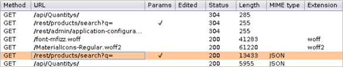

# Lab2 : Vulnerability Exploitation

## **Burp Suite 및 Firefox 구성**

OWASP Juice Shop 애플리케이션에 POC XSS 익스플로잇 코드를 주입하기 위해 RDP를 사용하여 Kali VM에 연결합니다. 연결되면 Kali Linux 배포판에 번들로 제공되는 강력한 웹 애플리케이션 보안 연구 및 분석 도구인 **[Burp Suite(Community Edition)를](https://portswigger.net/)** 사용합니다 . 이 플레이북에서는 대상 웹 애플리케이션에 POC XSS 페이로드를 주입할 때 어떤 일이 발생하는지 이해하기 위해 Burp Suite를 사용하여 애플리케이션 요청과 응답을 검사합니다.

Burp Suite는 클라이언트측 프록시로 작동하며 웹 브라우저는 Burp의 프록시 리스너를 가리켜야 요청과 응답을 가로챌 수 있습니다.

## 민감한 데이터 노출 및 유출

이 단계에서 공격자는 데이터 액세스 및 유출이라는 목표를 달성하기 위해 이전에 발견하고, 테스트하고, 추가로 개발한 취약점을 사용할 준비가 되었습니다. 이 플레이북에서는 SQL 주입 공격을 수행하여 OWASP Juice Shop 애플리케이션의 모든 사용자 자격 증명 목록을 공개하고 추출합니다.

### 대상 웹 애플리케이션에 대해 SQL 주입 수행

이 튜토리얼에서는 OWASP Juice Shop 애플리케이션에 대해 SQL 주입(SQLi) 공격을 두 번 수행합니다.

1. **시나리오 1** : 대상 웹 애플리케이션에서 직접 SQL 주입 수행
2. **시나리오 2** : Application Gateway에서 Azure WAF로 보호되는 동일한 대상 웹 애플리케이션에서 동일한 주입 수행

### **시나리오 1: OWASP Juice Shop 애플리케이션으로 직접 이동할 때 SQL 주입 수행**

1. 랩 자격 증명을 사용하여 Kali VM에 로그인합니다.
2. 웹 브라우저를 실행하고 URL http://owaspdirect-<deployment guid>.azurewebsites.net을 사용하여 OWASP Juice Shop 웹 사이트에 직접 액세스할 수 있는지 확인하고 또한 URL http://juiceshopthruazwaf.com 을 사용하여 Azure WAF를 통해 액세스할 수 있는지 확인하세요.
3. 왼쪽 상단의 **애플리케이션을** 클릭한 다음 **웹 애플리케이션 분석 --> burpsuite를 클릭하여 Burp Suite를** 실행합니다.
4. Burp Suite에서 이 웹사이트에 대한 요청 및 응답 데이터에 대한 **프록시 --> HTTP 기록 탭을 확인하세요.**
5. Juice Shop 웹사이트의 검색창에 "apple"을 입력하고 Burp Suite의 요청과 응답을 살펴보세요.
6. **검색할 때 클라이언트가 /rest/products/search** 엔드포인트 에 연결하는 것을 볼 수 있습니다.
    
    
    
7. **OWASP Juice Shop** 애플리케이션 의 **/rest/products/search** 엔드포인트는 SQL 주입에 취약합니다. 이 튜토리얼에서는 이 엔드포인트의 SQLi 취약점을 활용합니다.
8. **/rest/products/search** 엔드포인트 의 SQLi 취약점을 악용하기 위해 Burp Suite의 Repeater 기능을 사용하여 이 엔드포인트에 대한 요청에 특별히 제작된 SQL 쿼리를 삽입합니다.
9. 이렇게 하려면 **/rest/products/search** 엔드포인트에 대한 GET 요청 중 하나를 마우스 오른쪽 버튼으로 클릭한 다음 **Send to Repeater를 클릭합니다.**
    
    
    

1. 주입을 수행할 준비가 되면 다음 인코딩된 SQL 쿼리를 복사/붙여넣고 Burp Repeater 창의 요청 URI **/rest/products/search?q=** (쿼리 매개변수 값) 에 추가합니다.
    
    ```
    %71%77%65%72%74%27%29%29%20%55%4e%49%4f%4e%20%53%45%4c%45%43%54%20%69%64%2c%20%65%6d%61%69%6c%2c%20%70%61%73%73%77%6f%72%64%2c%20%27%34%27%2c%20%27%35%27%2c%20%27%36%27%2c%20%27%37%27%2c%20%27%38%27%2c%20%27%39%27%20%46%52%4f%4d%20%55%73%65%72%73%2d%2d
    ```
    
2. 요청 URI에 인코딩된 쿼리를 쿼리 매개변수 값으로 추가한 후  **이동**  **(또는 보내기 버튼)을 클릭합니다.**
    
    
    
3. 웹 애플리케이션에서 공개한 모든 사용자 및 자격 증명에 대한 세부 정보가 포함된 OWASP Juice Shop 애플리케이션의 성공적인 응답을 확인해야 합니다. 이는 SQL 주입 공격이 성공했음을 나타냅니다.
    
    
    

### **시나리오 2: Azure WAF를 통해 OWASP Juice Shop 애플리케이션으로 이동할 때 SQL 주입 수행**

이제 Azure WAF를 통해 OWASP Juice Shop 사이트로 이동할 때 동일한 쿼리로 SQL 주입을 수행해 보겠습니다.

1. Kali VM에서 Burp Suite 및 Firefox 브라우저의 새 인스턴스를 시작합니다.
2. Firefox를 사용하여 http://juiceshopthruwaf.com으로 이동하고 Burp Suite에서 이 웹 사이트에 대한 요청 및 응답 데이터에 대한 **프록시 --> HTTP 기록** 탭을 확인하세요.
3. 검색창에서 "apple"을 검색하고, 취약한 **/rest/products/search** 엔드포인트에 대한 요청을 찾아 Burp Repeater로 보냅니다.
4. 인코딩된 SQL 쿼리(위 시나리오 1의 10단계)를 Burp Repeater의 쿼리 매개변수 값으로 추가하고 **Go(또는 Send)를 클릭합니다.**
5. 응답을 조사한 결과 요청이 Application Gateway의 Azure WAF에 의해 차단되었음을 확인했습니다.
    
    
    

Juice Shop 애플리케이션의 동일한 인스턴스에서 SQL 주입을 수행하려는 두 번의 시도에 대한 HTTP 요청 및 응답을 검토하면 아래 표에 표시된 패턴을 볼 수 있습니다. 이는 애플리케이션에 저장될 수 있는 잠재적으로 악의적인 페이로드가 Azure WAF를 통해 허용되지 않음을 분명히 나타냅니다.

## 주요 요점

SQL 주입(SQLi)은 외부 공격자가 취약한 애플리케이션을 악용하여 애플리케이션의 중요한 정보를 공개하고 유출할 수 있게 하는 가장 일반적인 유형의 애플리케이션 보안 취약점 중 하나입니다.

**이를 통해 보호되는 웹 애플리케이션의 경우 Azure WAF는 기본 규칙 세트를 사용하여 네트워크 에지에서 의심스러운 SQL 쿼리를 감지하고 차단하여 SQLi(SQL 주입) 공격으로부터 보호할 수 있습니다.**