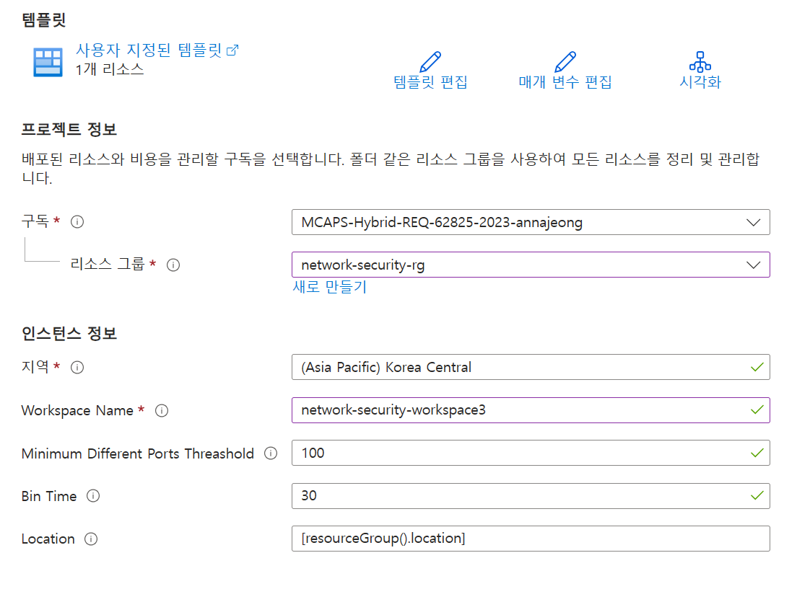

# Scenario3 : Port Scan

### 방화벽 로그 설정

1. Azure Portal 검색 창에서 방화벽를 검색한 다음, 사용 가능한 옵션에서 선택합니다.
2. **SOC-NS-FW**를 선택합니다.
3. 왼쪽 메뉴에서 진단 설정을 **클릭**하고 진단 설정 추가를 **클릭**합니다.
4. 아래와 같이 구성 후 저장 버튼을 **클릭**합니다.
    - 진단 설정 이름 : AzureFirewallLogs
    - 로그 : allLogs 선택
    - 메트릭 : AllMetrics 선택
    - 대상 세부 정보 : Log Analytics 작업 영역에 보내기
        - 구독 : 구독 선택
        - Log Analytics 작업 영역 : network-security-workspace

### 포트 스캔 경고 설정

1. Azure Portal 검색 창에서 **사용자 지정 템플릿 배포**를 검색한 다음, 사용 가능한 옵션에서 선택합니다.
2. **편집기에서 사용자 고유의 템플릿 빌드**를 선택하고 PortScan.json의 내용을 복사하여 붙여넣습니다.
3. 아래와 같이 설정하고 템플릿을 **배포**합니다.
    
    
    

    

1. Azure Portal 검색 창에서 **가상 머신**를 검색한 다음, 사용 가능한 옵션에서 선택합니다.
2. VM-Win2019의 프라이빗 IP 주소를 **복사**합니다.
3. 아래 명령어를 사용하여 TCP Syn Flooding 공격을 실행합니다.

### 포트 스캔

1. 랩 자격 증명을 사용하여 Kali Linux VM에 로그인합니다.
2. 터미널을 열어서 아래 명령어를 통해 포트 스캔을 실행합니다.
    
    ```bash
    sudo hping3 --scan 1-1000 -S <방화벽 IP 주소>
    ```
    

2. 터미널에서 아래처럼 실행 결과를 확인합니다.
    
    
    

3. Azure Portal 검색 창에서 방화벽를 검색한 다음, 사용 가능한 옵션에서 **선택**합니다.
4. 왼쪽 메뉴에서 로그를 **선택**합니다.
5. 편집기에 아래 쿼리를 입력 후 실행 버튼을 **클릭**합니다.
    
    ```sql
    // All firewall decisions 
    // All decision taken by firewall. Contains hits on network, application and NAT rules, as well as threat intelligence hits and IDPS signature hits. 
    AZFWNetworkRule
    | union AZFWApplicationRule, AZFWNatRule, AZFWThreatIntel, AZFWIdpsSignature
    | order by TimeGenerated desc 
    | take 100
    ```
    
6. 포트 스캔에 대해 방화벽이 정상적으로 Deny 액션을 수행한 것을 확인할 수 있습니다.
    
    
    

7. Azure Portal 검색 창에서 모니터를 검색한 다음, 사용 가능한 옵션에서 **선택**합니다.
8. 왼쪽 메뉴에서 경고를 **선택**합니다.
9. 5분 간격으로 발생한 Port Scan 공격을 확인할 수 있습니다.
    
    