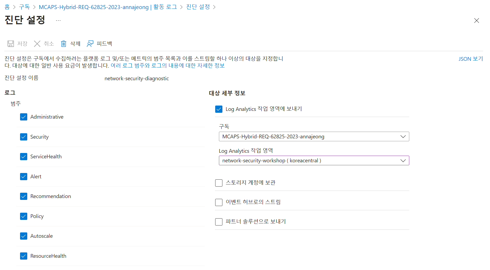

# README.md

1. 사전 준비
    - Log Analytics 작업 영역 만들기
    - Azure 구독에 대한 진단 설정 구성
2. Lab 환경 구성
    - ARM 템플릿 배포
3. 보안 리소스 배포
    - WAF: Azure 애플리케이션 게이트웨이 배포
    - Azure Firewall 배포
        - Azure Firewall Policy 구성
4. Kali Linux 업데이트 및 데스크탑 환경 설치
    - 방화벽 정책 수정
    - 리모트 데스크탑 설정
5. 시나리오 테스트
    
    [시나리오 1. Reconnaissance : Azure WAF 보안 보호 및 감지](https://www.notion.so/1-Reconnaissance-Azure-WAF-833077229bbd4087a31d7c2df932732a?pvs=21)
    
    - Port Scan
        
        [https://github.com/Azure/Azure-Network-Security/tree/master/Azure Firewall/Alerts - Queries and Alerts/Alert - Firewall Port Scan](https://github.com/Azure/Azure-Network-Security/tree/master/Azure%20Firewall/Alerts%20-%20Queries%20and%20Alerts/Alert%20-%20Firewall%20Port%20Scan)
        
    - Source IP abnormally connects to multiple destinations
    [https://github.com/Azure/Azure-Network-Security/tree/master/Azure Firewall/Alerts - Queries and Alerts/Alert - Firewall Source IP abnormally connects to multiple destinations](https://github.com/Azure/Azure-Network-Security/tree/master/Azure%20Firewall/Alerts%20-%20Queries%20and%20Alerts/Alert%20-%20Firewall%20Source%20IP%20abnormally%20connects%20to%20multiple%20destinations)

# 실습 내용

## 사전 준비

### Log Analytics 작업 영역 만들기

1. [Azure Portal](https://portal.azure.com/)의 검색 상자에 **Log Analytics**를 입력합니다. 입력을 시작하면 입력한 내용을 바탕으로 목록이 필터링됩니다. **Log Analytics 작업 영역**을 선택합니다.
2. **만들기**를 선택합니다.
3. 드롭다운에서 **구독**을 선택합니다.
4. 리소스 그룹에서 새로 만들기를 클릭하고 `network-security-rg`를 입력합니다.
5. 새 **Log Analytics 작업 영역**의 이름 `network-security-workspace`를 입력합니다. 이 이름은 리소스 그룹마다 고유해야 합니다.
6. `Korea Central` **지역**을 선택합니다. 
7. **검토 + 만들기**를 선택하여 설정을 검토합니다. 그런 다음, **만들기**를 선택하여 작업 영역을 만듭니다.

### Azure 구독에 대한 진단 설정 구성

1. 구독으로 이동하여 진단 설정을 활성화하려는 활성 Azure 구독을 선택합니다.
2. 활성 Azure 구독을 선택합니다.
3. 구독을 선택한 후 페이지 왼쪽 메뉴에서 **활동 로그**를 클릭하고 >> **진단 설정** 버튼을 클릭합니다.
4. 이제 "**+ 진단 설정 추가**"를 클릭한 다음 진단 설정 이름에 `network-security-diagnostic`을 입력합니다.
5. 모든 로그 범주를 선택하고 대상 세부 정보에서 Log Analytics 작업 영역에 보내기를 선택하고 생성한 구독의 Log Analytics 작업 영역을 선택합니다.
    
    
    
6. **저장** 버튼을 클릭합니다.

## Lab 환경 구성


이 설정에서는 공격자 머신(Kali VM)의 트래픽이 Azure Firewall을 통해 인터넷으로 라우팅됩니다. 성공적인 공격 경로는 공격자가 악성 데이터를 **OWASP Juice Shop** 웹 애플리케이션으로 직접 전송하여 악용에 성공하는 경로입니다. WAF에서 방어하는 공격 경로는 악성 데이터가 Azure WAF(Azure Application Gateway에서)에 의해 검사되고 웹 애플리케이션에 도달하기 전에 기본 규칙 세트를 사용하여 차단되는 경로를 나타냅니다.

### ARM 템플릿 배포

1. Azure Portal 검색 창에서 **사용자 지정 템플릿 배포**를 검색한 다음, 사용 가능한 옵션에서 선택합니다.
2. **편집기에서 사용자 고유의 템플릿 빌드**를 선택하고 [template.json](https://github.com/Anna-Jeong-MS/AzureSecurityWorkshop/blob/main/template.json)의 내용을 복사하여 붙여넣습니다.
3. 리소스 그룹에서 `network-security-rg`를 선택합니다.
4. 아래 Workspace 정보 부분에 앞서 생성한 **Log Analytics 작업 영역 정보**를 입력합니다.
    
    
    
5. 검토+만들기 버튼을 선택하여 유효성 검사에 성공하면 만들기를 선택하여 배포를 합니다.

## 보안 리소스 배포


### WAF: Azure 애플리케이션 게이트 웨이 배포

**웹 애플리케이션 방화벽 (WAF)**

웹 애플리케이션 방화벽은 백엔드 코드를 수정하지 않고도 취약성과 공격으로부터 웹 애플리케이션을 보호하여 애플리케이션 중단, 데이터 손실 및 공격을 방지합니다.

**WAF 정책**

WAF는 WAF 보안 정책을 설정하고 이를 Azure Front Door, Application Gateway 또는 CDN에 적용하여 HTTP 및 HTTP/s 수신기를 통해 구성됩니다.

**WAF: Azure 애플리케이션 게이트웨이**

Application Gateway와 결합된 WAF는 웹 트래픽 부하 분산 장치로 작동하고 백 엔드 풀(VM, VM 확장 집합, IP 주소 및 앱 서비스)에 L3-L7 보안을 제공합니다. 앱 게이트웨이에 대한 자세한 내용을 보려면 [AppGateway 기능](https://docs.microsoft.com/en-us/azure/application-gateway/features) 으로 이동하세요 .


1. Azure Portal 검색 상자에서 **애플리케이션 게이트웨이**을 입력하고 **Enter** 키를 누릅니다.
2. **SOC-NS-AG-WAFv2**를 선택합니다.
3. 왼쪽 메뉴에서 **웹 애플리케이션 방화벽**을 선택합니다.
4. WAF 구성에서 업그레이드를 **선택**합니다.
5. 이름에 **SOC-NS-AGPolicy**를 입력하고 업그레이드를 **선택**합니다.

**탐지** 모드에서는 공격 이벤트를 기록하는 동안 트래픽이 통과하도록 허용합니다. 이 모드를 사용하면 적절한 조정을 위해 처음에 트래픽 동작을 관찰하고 학습한 다음 예방 모드로 전환할 수 있습니다. 이는 권장되는 구성입니다.

*요청 **본문 크기 (KB)도 여기에서 편집할 수 있으며 제외** 영역 에서 제외할 요청 부분을 구성할 수 있습니다 .*

- **관리형 규칙 세트:** OWASP 상위 취약점 공격 목록입니다. OWASP 3.1 또는 최신 핵심 규칙 세트를 사용합니다.
- **사용자 정의 규칙:** 캐나다 또는 선택한 지리적 위치의 IP를 차단하려면 *+사용자 정의 규칙 추가를 클릭합니다.*
    - 맞춤 규칙 이름: 'blockCanada'를 입력하세요.
    - 상태: **활성화됨,** 규칙 유형: **일치,** 우선순위: **1** 또는 원하는 대로
    - IF **일치 유형**: 드롭다운- 위치정보
    - 캐나다를 선택하세요. 둘 이상을 선택할 수 있습니다.
    - 그런 다음: *트래픽 거부* (또는 사용자 정의 페이지로 리디렉션)를 선택합니다.
    - 추가를 클릭하세요
    - 

### Azure Firewall 배포

1. Azure Portal 메뉴 또는 **홈**페이지에서 **리소스 만들기**를 선택합니다.
2. 검색 상자에 **방화벽**을 입력하고 **Enter** 키를 누릅니다.
3. **방화벽**을 선택하고 **만들기**를 선택합니다.
    - 리소스 그룹 : network-security-rg
    - 인스턴스 정보
        - 이름 : SOC-NS-FW
        - 지역 : Korea Central
        - 방화벽 SKU: 표준
        - 방화벽 관리 : 방화벽 정책을 사용하여 이 방화벽 관리
        - Firewall policy: **SOC-NS-Policy**
        - 가상 네트워크 선택 : 기존 항목 사용
        - 가상 네트워크 : VN-HUB
        - 공용 IP 주소 : SOCNSFWPIP
4. **검토 + 만들기**를 클릭하고 유효성 검사가 통과하면 **만들기** 버튼을 클릭합니다.

### Azure Firewall Policy 구성

POC 시나리오에 대한 보안 허브 VNet의 방화벽 관리자를 통해 관리되는 방화벽 정책이 있습니다.

Azure Firewall Manager를 사용하면 네트워크에서 방화벽을 중앙 집중식으로 관리할 수 있습니다. 이 경우에는 방화벽이 하나만 있습니다. [Azure Firewall Manager에 대한 추가 정보](https://docs.microsoft.com/en-us/azure/firewall-manager/overview)

테스트 배포에서 방화벽 구성에 액세스하려면 다음 안내를 따르세요.


1. Azure Portal 검색 상자에서 **방화벽 정책**을 입력하고 **Enter** 키를 누릅니다.
2. SOC-NS-Policy를 **선택**합니다.

Azure Firewall 디자인은 기본적으로 명시적 거부입니다. 트래픽에 대한 규칙을 구성할 수 있습니다. 위 이미지에서 볼 수 있듯이 데모의 Azure 방화벽은 다음과 같이 구성되었습니다.

- *2스포크 VNET은 해당 서브넷 간에 직접 연결되어 있지 않습니다.*
- *테스트를 위해 Bing 및 Google과 같은 검색 엔진의 FQDN을 사용하여 액세스 권한을 부여하고 관리하도록 애플리케이션 규칙이 설정됩니다.*
- *SMB, RDP 및 SSH 만 허용 하고 다른 모든 것을 거부하는 네트워크 규칙이 구성되었습니다.*
- *방화벽을 통한 VM 액세스를 위해 고유한 NAT IP로부터의 액세스를 허용하는 DNAT 규칙이 구성되었습니다.*

—

## Kali Linux 업데이트 및 데스크탑 환경 설치

### 방화벽 정책 수정

**DNAT 규칙**

1. Azure Portal 검색 상자에서 **방화벽 정책**을 입력하고 **Enter** 키를 누릅니다.
2. SOC-NS-Policy를 **선택**합니다.
3. 왼쪽 메뉴에서 규칙 컬렉션을 **선택**합니다.
4. Add를 **클릭** 후, Rule Collection을 **선택**합니다.
    - 이름 : Kali-RDP
    - 규칙 컬렉션 형식 : DNAT
    - 우선순위 : 104
    - 규칙 컬렉션 그룹 : DefaultDnatRuleCollectionGroup
    - 규칙
        - 이름 : DNATRule
        - 원본 유형 : IP 주소
        - 원본 : *
        - 프로토콜 : TCP
        - 대상포트 : 33892
        - 대상 위치(방화벽 PIP 주소) : 방화벽 PIP 주소
        - 변환된 형식 : IP 주소
        - 변환된 주소 또는 FQDN : Kali VM IP 주소
        - 번역된 포트 : 3389

**네트워크 규칙**

1. DefaultNetworkRuleCollectionGroup의 IntraVNETAccess를 **선택**합니다.
2. 아래 규칙을 추가하고 저장 버튼을 **클릭**합니다.
    - 규칙
        - 이름 : Kali-HTTP
        - 원본 유형 : IP 주소
        - 원본 : Kali VM IP 주소
        - 대상 포트 : 80
        - 대상 유형 : IP 주소
        - 대상 : *

**애플리케이션 규칙**

1. DefaultApplicationRuleCollectionGroup의 Internet-Access를 **선택**합니다.
2. 아래 규칙을 추가하고 저장 버튼을 **클릭**합니다.
    - 규칙
        - 이름 : Kali-InternetAccess
        - 원본 유형 : IP 주소
        - 원본 : Kali VM IP 주소
        - 대상 포트 : Http:80,Https:443
        - 대상 유형 : FQDN
        - 대상 : *

### 리모트 데스크탑 설정

1. 로컬 머신에서 PowerShell을 실행하고 다음 명령을 실행하여 Kali VM에 연결합니다.

   ```bash
   ssh svradmin@<Azure Firewall의 공용 IP 주소>
   ```

1. SSH를 통해 Kali VM에 연결되면 다음 명령을 실행하여 Kali Linux 배포판을 업데이트합니다.
    
    ```bash
    sudo apt-get update
    ```
    

1. Kali Linux 배포판이 업데이트되면 다음 명령을 실행하여 Kali VM에 원격 데스크톱 서버를 설치하고 구성합니다.
    
    ```bash
    sudo apt-get install -y kali-desktop-xfce xorg xrdp
    sudo systemctl enable xrdp
    echo xfce4-session >~/.xsession
    sudo service xrdp restart
    ```
    

1. 위에서 언급한 단계를 완료하면 포트 33892에서 RDP를 통해 Kali VM에 연결할 수 있습니다.
    
    ```bash
    <Azure Firewall의 공용 IP 주소>:33892
    ```
    

1. Application Gateway에 게시된 OWASP Juice Shop 사이트의 공용 IP 주소에 이름을 매핑하기 위해 Kali VM의 HOSTS 파일에 항목을 만듭니다.
    
    ```bash
    sudo cat << EOF > /etc/hosts
    127.0.0.1 localhost
    127.0.1.1 kali
    <애플리케이션 게이트웨이의 공용 IP 주소> juiceshopthruazwaf.com
    EOF
    ```