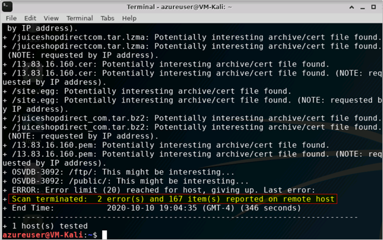

# Scenario1

### 정찰 공격

공격자는 취약점을 악용하기 전에 일반적으로 애플리케이션별 데이터를 수집하고 잠재적인 취약점을 분석하는 등 대상 웹 애플리케이션을 조사하는 데 시간을 보냅니다. 웹 애플리케이션의 잠재적인 취약점을 식별하기 위해 민감한 보안 데이터를 수집하는 방법 중 하나는 **웹 애플리케이션 보안 취약점 스캐너를 활용하는 것입니다**. 이러한 스캐너는 애플리케이션의 응답 헤더를 분석하여 잠재적인 취약점을 식별할 수 있습니다. 웹 애플리케이션 취약성 스캐너로 수집된 데이터는 공격자가 악용 또는 유출을 위해 테스트, 개발 및 활용할 수 있는 잠재적인 취약성을 드러낼 수 있습니다. 또한 이러한 정찰 활동을 통해 공격자는 나중에 사용할 수 있도록 애플리케이션을 철저하게 이해하고 완벽하게 매핑할 수 있습니다.

### 웹 애플리케이션 취약점 스캐너로 정찰 수행

공격자가 가장 먼저 시도하는 것 중 하나는 대상 웹 애플리케이션의 애플리케이션 구성 요소, 프레임워크 및 잠재적인 취약점에 대한 광범위한 이해를 시도하는 것입니다. 이를 수행하는 가장 빠르고 일반적인 방법은 상용 또는 오픈 소스 웹 애플리케이션 취약성 스캐너(보안 스캐너라고도 함)를 사용하여 대상에 대해 인증되지 않은/무단 스캔을 실행하는 것입니다. 이 튜토리얼에서는 대상 웹 애플리케이션에 대해 두 가지 웹 애플리케이션 취약점 스캔을 실행합니다.

1. **첫 번째 스캔은** 대상 웹 애플리케이션을 직접 가리킵니다.
    - URL: http://owaspdirect-<배포 GUID>.azurewebsites.net
2. **두 번째 스캔은** Application Gateway에서 Azure WAF로 보호되는 동일한 대상 웹 애플리케이션을 가리킵니다.
    - URL: [http://juiceshopthruwaf.com](http:)

### 대상 애플리케이션에 대해 웹 애플리케이션 취약점 검사 실행

웹 애플리케이션 취약점 스캔을 실행하기 위해 RDP를 사용하여 Kali VM에 연결합니다. 연결되면 Kali Linux 배포판에 번들로 제공되는 다목적 명령줄 오픈 소스 웹 애플리케이션 취약점 검색 도구인 **[Nikto를](https://cirt.net/Nikto2)** 사용합니다 . 대상 웹 애플리케이션을 가리키면 Nikto는 애플리케이션에서 일반적인 취약점을 검색하고 빠른 검토를 위해 터미널 창에 검색 결과를 표시합니다.

1. 랩 자격 증명을 사용하여 Kali Linux VM에 로그인합니다.
2. [웹 브라우저를 실행하고 URL http://owaspdirect-<deployment guid>.azurewebsites.net을 사용하여 OWASP Juice Shop 웹 사이트에 직접 액세스할 수 있는지 확인하고 URL http://juiceshopthruwaf.com](http:) 을 사용하여 WAF를 통해서도 액세스할 수 있는지 확인하세요.
3. **Nikto애플리케이션을웹 애플리케이션 분석 --> 웹 취약점 스캐너 --> Nikto를 클릭합니다.**
    
    Web Vulnerability Scanner 의 두 인스턴스를 시작합니다 . 왼쪽 상단에서
    
    클릭 한 다음
    
4. 스캔을 시작하려면 다음 명령을 사용하십시오. 열려 있는 각 Nikto 창에 하나씩
    1. **nikto -h http://owaspdirect-<배포 GUID>.azurewebsites.net**
    2. **nikto -h [http://juiceshopthruwaf.com](http:)**

### **웹 애플리케이션 취약점 검사 결과 검토**

1. Juice Shop 웹사이트로 직접 이동하면 스캐너가 웹 서버에 **7,000개 이상의 요청 1을** 보냈고 그 결과 **2개의 오류** 와 **150개 이상의 항목/문제가** 발견되었으며 이는 추가 공격 및 악용 시나리오를 개발하는 데 사용될 수 있습니다.
2. Azure WAF를 통해 Juice Shop 웹 사이트를 스캔하는 동안 1단계에서 웹 사이트를 직접 스캔하는 것과 비교할 때 스캐너가 **요청 수 1을 3배 이상** 생성했지만 여전히 보고할 **오류를 찾지 못한 것을 확인했습니다.** 마찬가지로 이 스캔은 웹사이트를 직접 스캔할 때와 비교하여 추가 조사를 위해 **항목/문제 수의 1%** 미만만 보고할 수 있습니다.

### 통합 문서에서 WAF 로그 검토

1. 통합 문서 블레이드로 이동한 다음 이 랩에 배포된 WAF 통합 문서를 선택하여 WAF 통합 문서에 액세스할 수 있습니다. 통합 문서에 들어가면 이벤트 필터에서 적절한 **시간 범위** , **WAF 유형 및 WAF 항목을** 선택했는지 확인하세요.
2. **또한 상위 10개 공격 IP 주소, 단일 IP 주소로 필터링** 창 에서 공격자 컴퓨터(Kali VM)에 대한 올바른 공용 IP 주소를 선택했는지 확인해야 합니다 **.**
3. 올바른 클라이언트 IP를 선택한 후 다시 통합 문서 상단으로 스크롤하고 WAF 통합 문서 상단의 시각화를 검토합니다. 여기서 사용할 통합 문서의 섹션은 아래 그림에서 알파벳순 설명선으로 강조 표시되어 있으며 다음 섹션에 매핑되는 것을 볼 수 있습니다.
    1.  WAF 작업 필터
    2. 차단된 요청 URI 주소 상위 40개, 단일 URI 주소로 필터링
    3. 상위 50개 이벤트 트리거, 규칙 이름으로 필터링
    4. 메시지, 전체 세부정보

### 통합 문서 섹션 개요

1. **WAF 작업 필터는** 위에서부터 일치 항목 수와 차단된 요청을 표시합니다.

    

2. 그런 다음 차단된 요청 URI 상위 40개 주소를 확인 **하고 단일 URI 주소로 필터링하여** WAF에 의해 요청이 차단된 상위 URI를 식별 할 수 있습니다.

    

2. 상위 **50개 이벤트 트리거, 규칙 이름으로 필터링하면** 스캐너 트래픽을 평가한 모든 규칙이 표시됩니다.
    
    
    

- 아래 표는 스캐너 트래픽에 대한 **규칙 이름 출력을 기준으로 필터링한 상위 50개 이벤트 트리거 의 추출을 보여줍니다.**
    
    이 데이터는 WAF가 보안 스캐너를 감지하고 Nikto Scanner에서 의심스러운 요청/페이로드를 차단할 수 있었음을 분명히 보여줍니다. 이는 보안 스캐너가 웹 애플리케이션의 보안을 테스트하기 위해 다양한 유형의 작업을 수행하려고 시도하기 때문에 예상되는 현상입니다.
    

| 규칙 | 집계 |
| --- | --- |
| 보안 스캐너와 연결된 사용자 에이전트를 찾았습니다. | 8906 |
| 수락 헤더가 누락된 요청 | 8906 |
| 본문 콘텐츠가 포함된 GET 또는 HEAD 요청. | 8860 |
| 노드 검증기 블랙리스트 키워드 | 4553 |
| SQL 주입 공격: 일반적인 주입 테스트가 감지됨 | 3354 |
| 보안 스캐너와 관련된 요청 파일 이름/인수를 찾았습니다. | 2422 |
| 가능한 RFI(원격 파일 포함) 공격: 도메인 외부 참조/링크 | 2418 |
| 가능한 RFI(원격 파일 포함) 공격: 후행 물음표 문자(?)와 함께 사용된 URL 페이로드 | 2355 |
| 기본 SQL 인증 우회 시도 탐지 2/3 | 2249 |
| MySQL 주석, 조건 및 ch(a)r 주입을 감지합니다. | 2233 |
| 경로 순회 공격(/../) | 1698년 |
| OS 파일 액세스 시도 | 699 |
| 원격 명령 실행: Unix 셸 코드 발견 | 682 |
| libinjection을 통해 XSS 공격이 감지되었습니다. | 667 |
| SQL 주입 공격: SQL Tautology가 감지되었습니다. | 641 |
| 가능한 XSS 공격이 감지됨 - HTML 태그 핸들러 | 616 |
| XSS 필터 - 카테고리 1: 스크립트 태그 벡터 | 616 |
| NoScript XSS 주입 검사기: HTML 주입 | 616 |
| 클래식 SQL 주입 조사 감지 2/3 | 455 |
| 요청에 잘못된 문자가 있습니다(인쇄할 수 없는 문자). | 342 |
| 요청에 잘못된 문자가 있습니다(널 문자). | 340 |
| SQL 주입 공격 | 272 |
| 원격 명령 실행: Unix 명령 주입 | 199 |
| SQL 주석 시퀀스가 ​​감지되었습니다. | 197 |
| URL 파일 확장자는 정책에 의해 제한됩니다. | 192 |
| 제한된 파일 액세스 시도 | 178 |
| SQL 16진수 인코딩이 확인됨 | 147 |
| 가능한 RFI(원격 파일 포함) 공격: URL 페이로드와 함께 사용되는 일반적인 RFI 취약 매개변수 이름 | 136 |
| PHP 삽입 공격: 고위험 PHP 함수 호출 발견 | 128 |

1. **메시지, 전체 세부정보** 섹션 에서 자세한 내용을 검토하세요.

[https://techcommunity.microsoft.com/t5/image/serverpage/image-id/244426i3C23069AC845EB5A/image-size/large?v=v2&px=999](https://techcommunity.microsoft.com/t5/image/serverpage/image-id/244426i3C23069AC845EB5A/image-size/large?v=v2&px=999)

## 주요 요점

보안 스캐너를 사용하여 웹 애플리케이션 취약성 평가 스캔을 수행하여 대상 웹 애플리케이션의 취약성을 노출시키는 것은 공격자가 사용하는 일반적인 기술입니다. 외부 공격자가 웹 애플리케이션에 대해 이러한 스캔을 수행할 수 있으면 애플리케이션 설계와 잠재적으로 악용으로 이어질 수 있는 취약점에 대해 배울 수 있습니다.

**이를 통해 보호되는 웹 애플리케이션의 경우 Azure WAF는 기본 규칙 세트를 사용하여 네트워크 에지에서 보안 스캐너로 실행되는 정찰 공격을 감지하고 보호할 수 있습니다.**